----

marp: true
math: katex
header: Gefahrengut | ERP-Systeme | Agreš, Kiriakou, Koch, Nur
paginate: false
style: |
  pre {
    font-size: 16px;
  }
  code {
    font-size: 20px;
  }
  li, p, td, th {
    font-size: 26px;
  }
  h1 {
    font-size: 30px;
  }
  h2 {
    font-size: 30px;
  }
  .columns {
    display: flex;
    gap: 1rem;
  }
  .columns > div {
    flex: 1 1 0;
  }

----

# Stammdaten - Gefahrengut
 
## ERP-Systeme

Dominik Agreš, Chris Kiriakou, David Koch, Berkan Nur

<style scoped>
h1 {
    font-size: 80px;
    text-align: center;
    padding: 10px;
    margin: 10px;
}

h2 {
    font-size: 50px;
    text-align: center;
    padding: 10px;
    margin: 10px;
}

section {
    text-align: center;
}

header {
    color: #FFFFFF00;
}
</style>

<!--
David
-->

----

# Gliederung

1. Einführung Gefahrengut
2. Automatische Prüfung (ohne KI)
3. KI basierter Ansatz
4. Fehlererkennung mit ML
5. Fazit 

<!-- paginate: true -->

<!--
David
-->

----

# Einführung Gefahrengut

| Bezeichnung        | Beschreibung                                                         |
|--------------------|----------------------------------------------------------------------|
| Landecode für GG   | z.B. CA = Kanada, HU = Ungarn                                        |
| Art_IdentNr        | Einzige Art in Stammdaten = UN                                       |
| IdentNr            | UN-Nummern, Stoffnummern - jedes Gefahrengut hat eig. Nummer         |
| Klasse             | Gefahrgutklassen Unterteilt in 9 Klassen, mit Unterklassen (.2, .1)  |
| GG_Vorschrift See  | IMDG, International Maritime Dangerous Goods Code                    |
| Verp. Methode See  | Verpackungsmethode für Seefracht                                     |
| GG_Vorschrift Luft | IATA_C, IATA_P, International Air Transport Association              |
| Verp. Methode Luft | Verpackungsanforderung für Lufttransport                             |

<!--
David
-->

----

# Einführung Gefahrengut ─ Was ist Gefahrengut?

- Gefahrgut bezeichnet Stoffe und Gegenstände, die beim Transport Risiken für Gesundheit, Umwelt oder Sicherheit darstellen.
- Typische Beispiele: entzündbare Flüssigkeiten, explosive Stoffe, Gase, radioaktive Materialien.
- Der Transport unterliegt internationalen Vorschriften wie IMDG (Seeweg), ADR (Straße) oder IATA (Luftverkehr).
- Im ERP-System müssen solche Materialien korrekt klassifiziert, gekennzeichnet und mit Regeln verknüpft werden.

<!--
David
-->

----

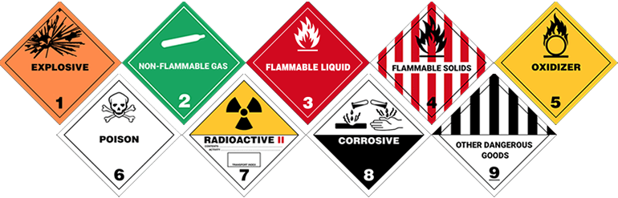


<!--
David
-->

----

# Einführung Gefahrengut ─ Probleme & Ansätze

**Probleme**
- Sehr lückenhafte und teils undurchsichtige IATA-Klassifizierungen
- Unklarheiten: Stimmen **GG_Vorschrift Luft** und **Verpackungsmethode** (IATA-Bezeichnung/Nummer) überhaupt überein?
- Unterschiedliche Verpackungsmethoden bei gleicher IATA-Nummer trotz gleichem Land
  $\rightarrow$ vermutlich abhängig von *Modulgruppe*

**Ansatz zur Regelprüfung**
- Ermitteln von Abhängigkeiten zwischen Feldern
- Filtern nach einzelnen oder ähnlichen Modulgruppen
- Beispiele aus der Tabelle als Grundlage nutzen

<!--
David
-->

---- 
 
# Automatische Prüfung ─ Bezeichnungsanalyse

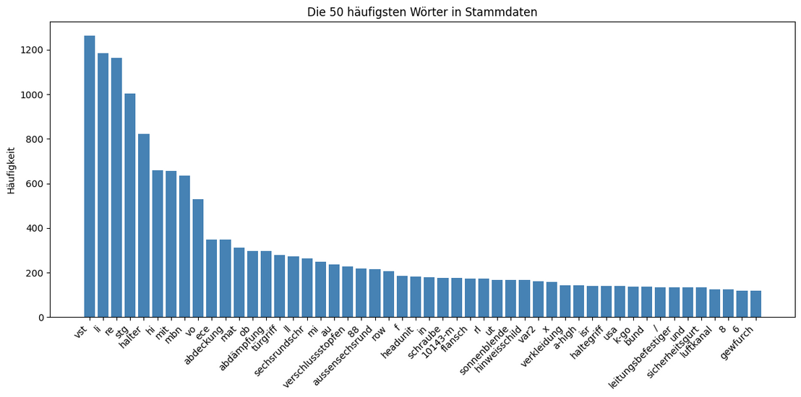
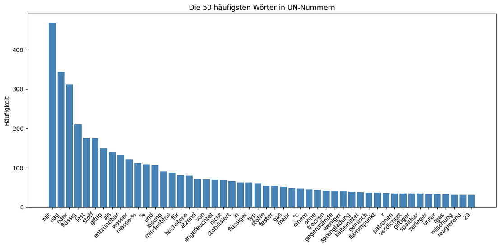

- Analyse semantische Beziehungen **'Material-Bezeichnung'** in den Stammdaten mit den Bezeichnern in UN-Nummern hergestellt
- Durch Beziehungen zuordnen Materialien v. Modulgruppen zu UN-Nummern 
- Für effizienteres Verarbeiten der Daten *Grundrauschen* entfernen

<!--
Chris
-->

----

# Automatische Prüfung ─ Bezeichnungsanalyse

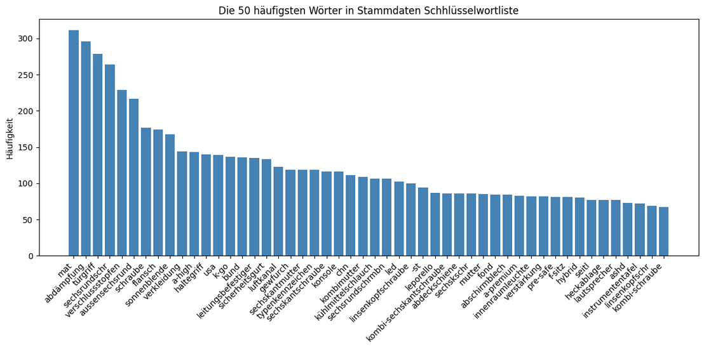
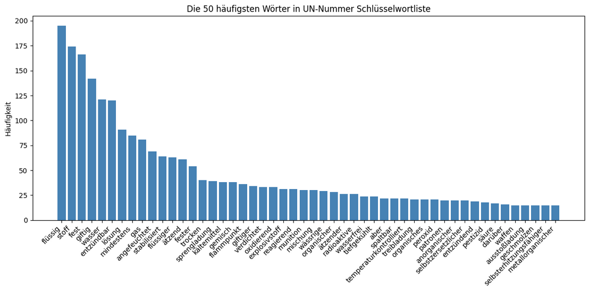

- Filtern `stop_words` aus Bezeichnungsfeldern
- `stop_words` haben keinen Semantischen Mehrwert $\rightarrow$ entfernen!
```python
stop_words = {
    'und', 'mit', 'für', 'von',
    'in', 'an', 'auf', 'im',
    'vst', 'stg', 'nag' ...
    }
    
def sanitize_text(text):
    if not isinstance(text, str):
        return set()
    text = (
        text.lower()
        .replace('ae', 'ä')
        .replace('oe', 'ö')
        .replace('ue', 'ü')
        ...
    )
```

<!--
Chris
-->

----

# Automatische Prüfung ─ Bezeichnungsvergleich

- Vergleichen jedes Schlüsselworts aus **'Material-Bezeichnung'** mit allen Schlüsselwörtern der UN-Nummern $\rightarrow$ festgestellt welche Zeilen welchen der UN-Nummern ähneln
- Verfahren $m \times n$: schlechte Laufzeitkomplexität
- **Fuzzy-Algorithmus**: Erkennen gleicher Substrings der Schlüsselwörter
- **Nachteil**: Kontext wird nicht berücksichtigt, trotz ähnlichkeit entstehen Fehler

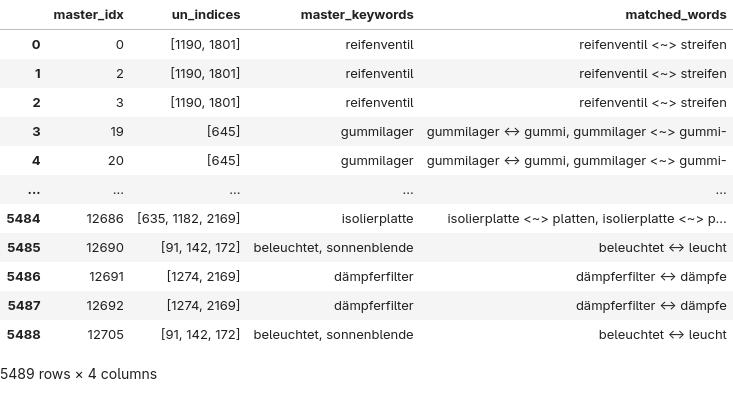

<style scoped>
p { text-align: center; }
</style>

<!--
Chris
-->

----

# Automatische Prüfung ─ Erkennung Unregemäßigkeiten

- Erkennen von Unregemäßigkeiten:
    - Spalte **'Art_IdentNr'** prüfen ob Wert `UN` gesetzt
    - Wenn ja, aus Spalte 'Material-Bezeichnung' der gleichen Zeile das erste Wort entnehmen
- Masken: Verundung durch gesetzte & ungesetzte **'Art_IdentNr'**-Spalte $\rightarrow$ Gruppieren "ähnlicher" Material-Bezeichner

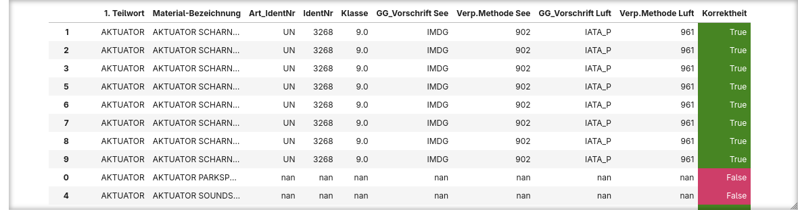

<style scoped>
p { text-align: center; }
</style>

<!--
Chris
-->

----

# Automatische Prüfung ─ Fehlerbehebung

<div class="columns">
<div>

- Leere Zeilen mit Werten aus gleicher Wortgruppe ausfüllen
- **Annahme**: Bereits ausgefüllte Zeilen mit `UN` sind korrekt

**Definition Wortgruppe**:
> Teilwort umschließt jedes Materialbezeichnungsfeld welches dieses besitzt
 
</div>
<div>

```Python
for first_word in inconsistent_first_words:
    group = grouped.get_group(first_word)

    # Find valid row: must be 'UN'
    valid_source_rows = group[
        (group['Art_IdentNr'] == 'UN') &
        (group['IdentNr'].notna()) &
        (group['Klasse'].notna())
    ]
```
```Python
for idx, row in group.iterrows():
    row_dict = row.to_dict()
    row_dict['Ursprungsindex'] = idx

    if row['Art_IdentNr'] != 'UN':
        row_dict['Art_IdentNr'] = 'UN'
        if pd.isna(row['IdentNr']):
            row_dict['IdentNr'] = correct_ident
        if pd.isna(row['Klasse']):
            row_dict['Klasse'] = correct_klasse
```
</div>
</div>

<!--
Chris
-->

----

# Automatische Prüfung (ohne KI) & Fehlerbehebung

- Zuordnung zu **1. Teilwort** funktioniert im Falle von Stoßdämpfern gut
- Bei Aktuatoren z.B. "AKTUATOR SOUNDSYS" & "AKTUATOR PARKSPERRE"
  $\rightarrow$ Soundsystem ist kein Gefahrengut!
  
**'IdentNr'** 3268:
> Airbag-Gasgeneratoren, pyrotechnisch oder Airbag-Module, pyrotechnisch oder Gurtstraffer, pyrotechnisch oder Sicherheitseinrichtungen, elektrische Auslösung
 
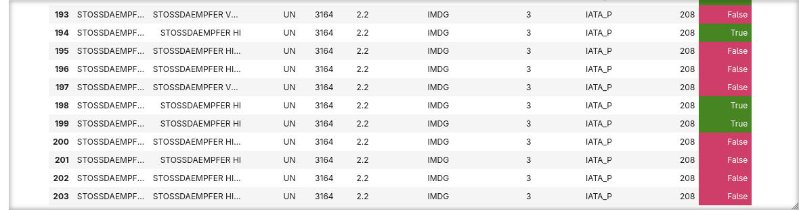
 
<!--
Chris
-->

----
 
# KI basierter Ansatz ─ Grundlogik

<!--
Berkan
-->

- Durch Analyse von Daten: **Distinct** anwenden auf **Material-Bezeichner**
  - Reduktion von 12000+ Materialien auf ca. 3000 Materialien
- Auf diese Materialien folgende Logik anwenden:
  - Material-Bezeichner in ein LLM einlesen
  - Output Format angeben, z.B. "Art_Identifikationsnummer, Identifikationsnummer, Klasse"
  - Output letztlich ins Projekt wieder einfügen

----

# KI basierter Ansatz ─ Automatisierung

<!--
Berkan
-->

- **Automatisierbar!** Unsere Schritte sind vorgegeben.
- Ziel: Mit einer LLM-API, e.g. OpenAI-API die Frage **je Material** zu stellen
    - Bei 3000+ Materialien notwendig, da man sonst Stundenlang prompts schreiben muss
- Dazu ein Script, der für uns die Materialien einliest, bearbeitet und ausgibt

----

# KI basierter Ansatz ─ Automatisierung

<div class="columns">
<div>

Material-Bezeichner auf **Distinct** Materialien verringern:
- 'STG VST PARKSYS A-HIGH VAR2' existiert mehrmals, brauchen den Prompt aber nur 1x
- Kann einfach durch Excel manuell durchgeführt werden

</div>
<div>

```
REIFENVENTIL
STECKERGEHAEUSE
SCAUBSCHUTZKAPPE
REIFEN 265/40 R19 102V XL ALL SEASON EXT
REIFEN 265/35 ZR19 98Y XL MI
REIFEN 255/40 R18 99Y XL CO
REIFEN 255/35 R19 96Y XL PI
REIFEN 225/50 R17 94Y MI
REIFEN 225/50 R17 94Y EXTENDED BS
REIFEN 235/55 R18 100W EXTENDED BS
REIFEN 245/45 R17 99Y XL MI
REIFEN 255/40 ZR20 101Y XL MI
VENTILMUTTER
REIFEN 225/45 R18 95Y XL EXTENDED BS
REIFEN 235/55 R18 100W EXTENDED PI
REIFEN 275/40 R19 105V XL ALL SEASON EXT
REIFEN 255/35 R19 96Y XL GY
GUMMILAGER
TANKDECKEL
EINSPRITZDUESE REDUKTIONSADDITIV
DICHTRING. SONDERFORM
KUEHLMITTELPUMPE
```

</div>

<!--
Berkan
-->

----

# KI basierter Ansatz ─ Automatisierung


<div class="columns">
<div>

- In Python Inputdaten auslesen und ein prompt per Material für das LLM erstellen
- Prompt soll hier im besten Fall Daten beispielsweise wie folgt ausgeben: `KRAFTSTOFFBEHAELTER VST,UN,1203,3`
- Falls nichts gefunden wird: `KRAFTSTOFFBEHAELTER VST,,,`

</div>
<div>

```Python
def create_prompt(client, material: str) -> str:
    response = client.responses.create(
        model="gpt-4o-mini",
        input=
            f'Gebe im format'
            f'"{material},UN,UN-Nummer (Die Zahl, z.B. 1234),Klasse (z.B. 2.1)"'
            f'an, es eine UN Nummer und Klasse für folgendes gibt: {material}\n'
            f'Falls es keine UN Nummer gibt, gebe es so aus:\n'
            f'\"{material},,,\"\n'
            f'Behalte die Formatierung (Full caps bleibt full caps)'
    )
    return response.output_text
```

<div>

<!--
Berkan
-->

----

# KI basierter Ansatz ─ Automatisierung


- Loop um Materialien abzuspeichern

```Python
with open(input_path, "r", encoding="utf-8") as inputfile:
    for raw_line in inputfile:
        line = raw_line.rstrip("\r\n")
        response = create_prompt(client, line)
        with open(output_path, "a", encoding="utf-8") as outfile:
            outfile.write(response + "\n")
        print(f"Written Material {iterator} out of {lines}")
        iterator += 1
```
- Letztlich Distincte Daten per Material-Bezeichner wieder in Excel auffüllen **(Skalieren)**
- Kann gemacht werden durch auslesen von Rows in den Stammdaten,
  beispielsweise: `if row_dict['Material_Bezeichner'] == {ai_material_bezeichner}` 
    - Falls unser Material Bezeichner gleich ist mit dem Material_Bezeichner in den Stammdaten:
        - `row_dict['Art_IdentNr'] = {ai_material_ident_nr}` usw.

<!--
Berkan
-->

----

# KI basierter Ansatz ─ Probleme

- LLM ist sehr unvorhersehbar
- Prompt output nicht einheitlich
    - Manuelle Analyse von ~3000 Zeilen benötigt
- Trotz klügerem Modell (o4), trotzdem keine gute Gefahrgutanalyse

<!--
Berkan
-->

----

# KI basierter Ansatz ─ Probleme

<div class="columns">
<div>

```csv
EIFEN HL 255/35 R19 99W
OELSPRITZDUESE RE,,,"
```

```csv
INPULSRING,,,
"STG VST DBE ASHD NOTRUF IRS,,,"
ABSORBER OB VO LT
```

```csv
HALTER PARKSYS,,,
"WARTUNGSDECKEL VST,,,,,"
```

</div>
<div>

```csv
SCHUTZWAND HI LI,,,
"ABSCHIRMPLATTE,,,,"
```

```csv
EINLAGE STAUFACH,,,
VERSTAERKING OB LI SCHARNIER,,,
KONSOLE VO RE DACH HALTEGRIFF,,,
```

</div>

<!--
Berkan
-->

----

# KI basierter Ansatz ─ Probleme

```csv
ABDECKBLENDE RL,,,
NOCKENWELLENLAGERDECKEL OB,,,
Es gibt keien UN NUMMER und Klasse dafür.
Bitte teile mir mit, welche MUTTER. DONDERFORM du meinst, damit ich die INformationen bereitstellen kann.
```

```csv
TRAEGEPLATTE RE,,,

ES gibt keien spezifische UN-NUmmer oder Klasse für "TRAEGERPLATTE RE".
SICHERHEITSGURT LI 3.SITZREIHE,,,"
ANSCHLAGPLATTE RE,,,

Es gibt keine spezifische UN-Nummer oder Klasse für "ANSCHLAGPLATTE RE".
SCHALTERBLOCK LICHTSCHALTER EPS,,,
ABDECKUNG INSTRUMENTENTAFEL OB LL MAUTER,,,
KETTENKASTENDECKEL,,,
```

<!--
Berkan
-->

----

# Fehlererkennung mit ML

## Zusammenfassung

- Anwenden von Maschinellen Lernmodellen um Muster zu erkennen
- Felder mit fehlenden UN Nummern die ähnliche Muster verfolgen für menschliche Bearbeitung markieren
- Schritte:
  - Daten vorbereiten für ML
  - Analyse der Daten
  - ML Model tranieren & "Prediction Probability" prüfen
  - High-Probability Werte extrahieren

<!--
Dominik
-->

----

# Fehlererkennung mit ML ─ Preprocessing

- Entfernen der Identifikation & Label Felder
- Füllen der Lücken im Datensatz mit "MISSING"
- Teilen der Daten auf Test- und Trainingssets für das Training
- Encoden der String-Values in ML interpretierbare Integer-Values

<!--
Dominik
-->

----

# Fehlererkennung mit ML

**Korrelation zw. Features**:
- Wie korrelieren bestimmte Felder mit dem Feld "Art_IdentNr"?
- Hohe Korrelation = Aussagekräftiges Feature

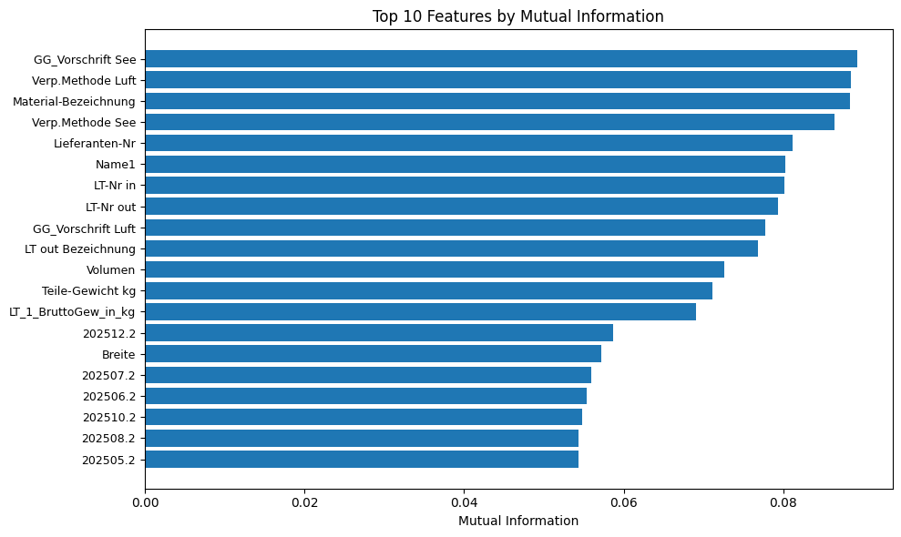

<!--
Dominik
-->

----

# Fehlererkennung mit ML ─ Training RandomForestClassifier

```python
# RF
rf = RandomForestClassifier(n_estimators=200, random_state=42, n_jobs=-1)
rf.fit(X_train, y_train)

## Predict probabilites werden auf die X_val Daten angewendet
probs = rf.predict_proba(X_val)[:,1]

## Treshold berechnen aus der precision-recall-Kurve
prec, rec, thresh = precision_recall_curve(y_val, probs)

## Bestimmung des Tresholds für eine gewünschte Präzision
target_prec = 0.80
candidates = np.where(prec[1:] >= target_prec)[0]
if len(candidates):
    chosen_idx = candidates[0]
    chosen_thresh = thresh[chosen_idx]
    print(f"Using threshold = {chosen_thresh:.3f} for ≥ {target_prec*100:.0f}% precision")
else:
    chosen_thresh = 0.5
    print(f"Couldn't find {target_prec}% precision; defaulting to 0.5")
```

<!--
Dominik
-->

----

# Fehlererkennung mit ML ─ Training RandomForestClassifier

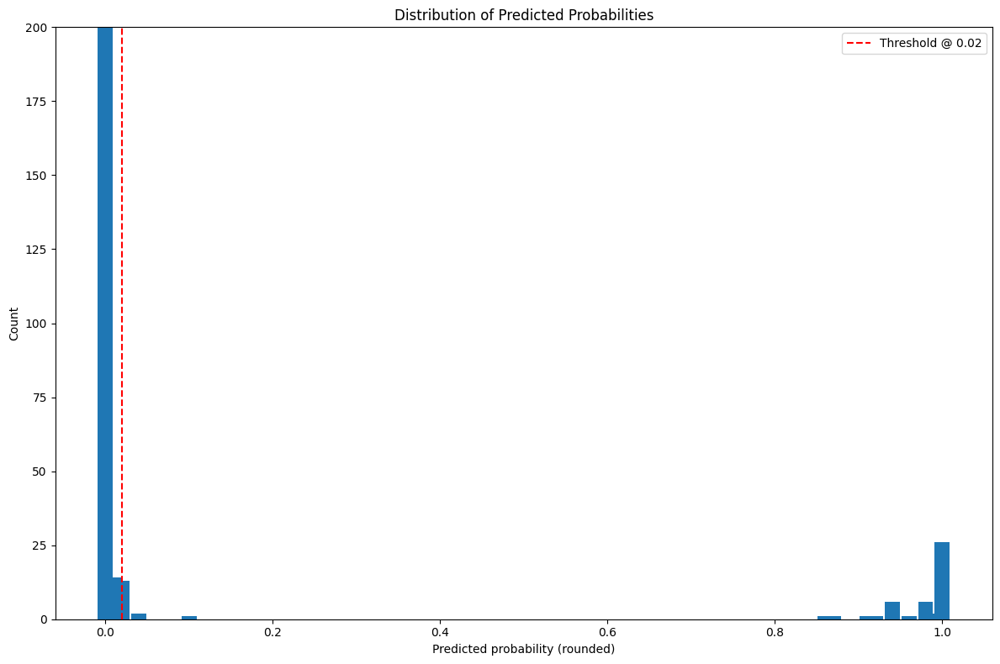 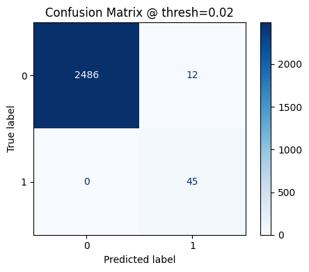

<style scoped>
p { text-align: center; }
</style>

<!--
Dominik
-->

----

# Fehlererkennung mit ML ─ SHAP-Analyse 

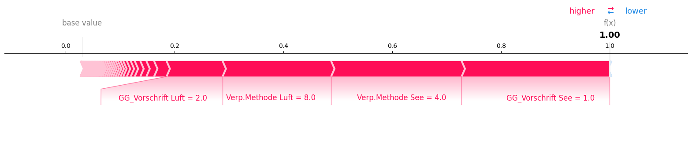
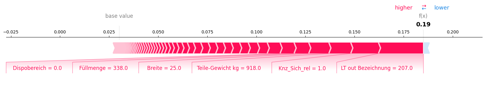

<!--
Dominik
-->

----

# Fehlererkennung mit ML ─ SHAP-Analyse

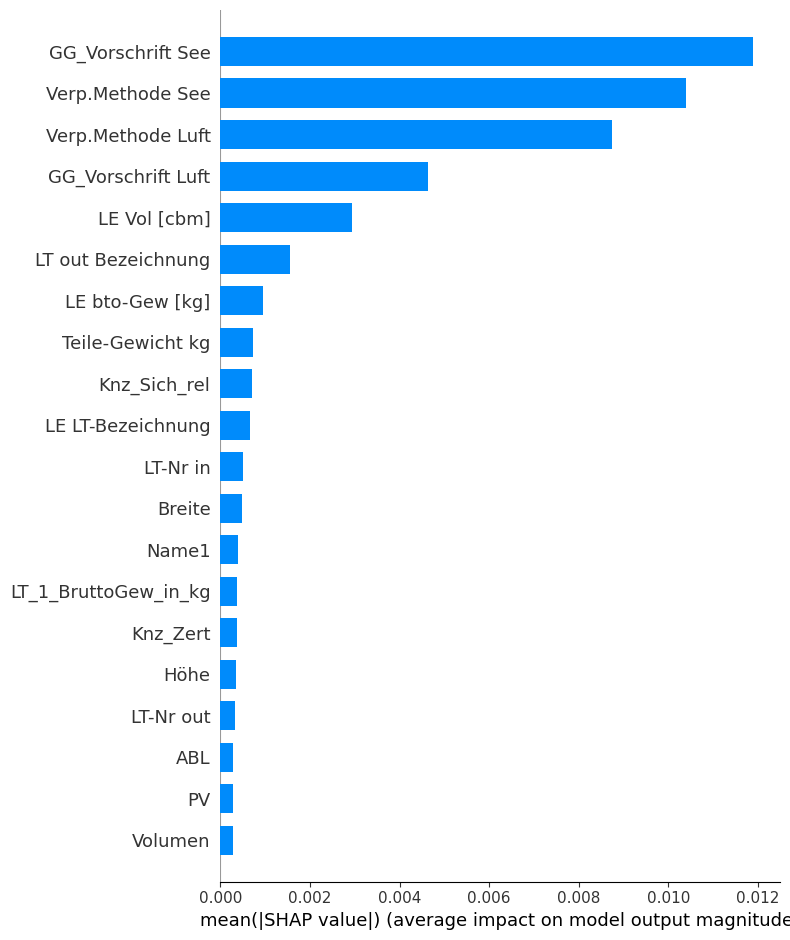

<style scoped>
p { text-align: center; }
</style>

----

# Fehlererkennung mit ML ─ Ergebnissanalyse

27 Gefundene Zeilen mit hoher Gewissheit:

```csv
ID-Nummer,Material-Bezeichnung,pred_prob_art
30412784,BATTERIE MBN 10307-12V 1.2AH AGM UP,0.105
30447516,BATTERIE MBN 10307-12V 1.2AH AGM UP,0.08
30441645,BATTERIE MBN 10307-12V 1.2AH AGM UP,0.075
30444849,2-KOMPONENTEN-KLEBSTOFFHAERTER,0.06
30438259,STG VST TABLET-PC COMAND-CENTER CHN,0.06
30438257,STG VST TABLET-PC COMAND-CENTER,0.045
30444849,2-KOMPONENTEN-KLEBSTOFFHAERTER,0.04
30414759,STG VST ALARMSIRENE,0.04
30411471,MONTAGEOEL / P80 DBL 8600.70,0.035
30411336,KLEBSTOFF,0.035
30433723,PRODUKTSCHUTZFOLIE,0.035
30335092,GERAEUSCHISOLIERUNG,0.035
30381263,KLEBSTOFF,0.03
30416445,KLEBSTOFF,0.025
30441565,BATTERIE MBN 10307-12V 1.2AH AGM UP,0.025
```

<!--
Dominik
-->

----

# Quellen

- UN-Nummer Liste [https://de.wikipedia.org/wiki/Liste_der_UN-Nummern](https://de.wikipedia.org/wiki/Liste_der_UN-Nummern)
- IATA [https://www.iata.org/](https://www.iata.org/)
- OpenAI API [https://openai.com/api/](https://openai.com/api/)
- OpenAI Python Wrapper [https://github.com/openai/openai-python](https://github.com/openai/openai-python)
- Github Repository mit Notebook und Präsentation [https://github.com/ckiri/gg](https://github.com/ckiri/gg)

<!--
Bitte fehlende Quellen hinzufügen
-->
 
<style scoped>
li {
    font-size: 14px;
}
</style>
